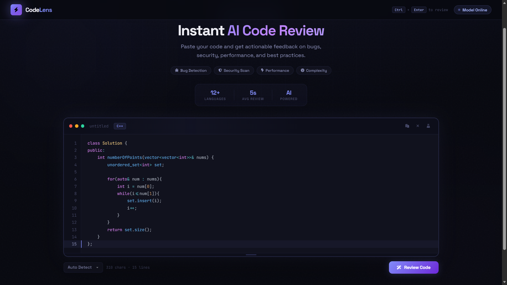

# ⚡ CodeLens — AI Code Reviewer

<p align="center">
  
</p>

<p align="center">
  <strong>AI-powered code review platform that analyzes source code for bugs, security issues, performance bottlenecks, complexity, and best practices in seconds.</strong>
</p>

<p align="center">
  
  
  
  
  
</p>

---

# 🚀 Live Demo

**🌐 Live:** 
Frontend : https://codelens-repo.vercel.app/
Backend : https://ai-code-reviewer-1zth.onrender.com

---

# 💻 Supported Languages

<p align="center">


</p>

---

# 📖 Overview

CodeLens is an AI-powered code review application that helps developers quickly identify bugs, security vulnerabilities, performance issues, code smells, and optimization opportunities.

Instead of only pointing out problems, CodeLens also generates:

- ✅ Optimized code
- ✅ Complexity analysis
- ✅ Actionable suggestions
- ✅ Overall code quality score
- ✅ Final verdict

The application supports multiple programming languages including C++, Python, Java, JavaScript, C#, Go, Rust and more.

---

# ✨ Features

- 🔍 AI-powered static code review
- 🐞 Bug detection
- 🔐 Security vulnerability analysis
- ⚡ Performance optimization suggestions
- 🧠 Time & Space Complexity estimation
- 📊 Code Quality Score
- 📝 Optimized code generation
- 💡 Best practice recommendations
- 🌙 Modern responsive UI
- 🌐 Multi-language support

---

# 🏗️ Architecture

```
Frontend
│
├── HTML
├── CSS
└── JavaScript
        │
        ▼
Flask Backend
        │
        ▼
Gemini 2.5 API
        │
        ▼
Structured AI Analysis
        │
        ▼
Formatted Review Results
```

---

# 📂 Project Structure

```
CodeLens/
│
├── app.py
├── requirements.txt
├── favicon.ico
├── index.html
│
└── src/
    ├── reviewer.py
    ├── parser.py
    ├── prompt.py
    ├── request.py
    ├── fixer.py
    └── executor.py
```

---

# ⚙️ Installation

### Clone Repository

```bash
git clone https://github.com/Nasibyun/ai-code-reviewer.git
```

### Enter Project

```bash
cd ai-code-reviewer
```

### Install Dependencies

```bash
pip install -r requirements.txt
```

### Configure Environment

Create a `.env`

```env
GOOGLE_API_KEY=YOUR_API_KEY
```

### Run

```bash
python app.py
```

---

# 🧠 AI Review Pipeline

```
User Code
      │
      ▼
Language Detection
      │
      ▼
Prompt Engineering
      │
      ▼
Gemini 2.5 API
      │
      ▼
Structured Parsing
      │
      ▼
Review Report
```

---

# 📊 Performance

| Metric | Value |
|---------|-------|
| Languages Supported | 12+ |
| Average Review Time | **~3.4 seconds** |
| Tested File Size | 20–300+ Lines |
| Backend | Flask |
| AI Model | Gemini 2.5 |

### Performance Highlights

- ⚡ Achieved an average review latency of **~3.4 seconds** across source files ranging from **20 to over 300 lines**.
- 📈 Observed that **response time is primarily dominated by AI inference**, while input size contributes only marginally to total latency.
- 🚀 Maintains consistent performance across different programming languages and varying code complexity.
- 🔄 Optimized prompt generation and response parsing to minimize backend overhead.

---

# 📈 Example Analysis

CodeLens automatically provides:

- Overall Code Quality Score
- Bug Detection
- Security Analysis
- Performance Review
- Complexity Analysis
- Optimized Code
- Suggested Fixes
- Final Verdict

---

# 🛠️ Tech Stack

| Category | Technology |
|----------|------------|
| Frontend | HTML, CSS, JavaScript |
| Backend | Flask |
| AI | Google Gemini 2.5 |
| Styling | Custom CSS |
| API | REST |

---

# 📌 Future Improvements

- User authentication
- Review history
- GitHub repository integration
- File upload support
- Dark / Light themes
- Export reports as PDF
- Inline code annotations
- Batch file review

---

# 🤝 Contributing

Contributions are welcome.

1. Fork the repository
2. Create a feature branch
3. Commit changes
4. Push to GitHub
5. Open a Pull Request

---

# 📄 License

This project is licensed under the MIT License.
